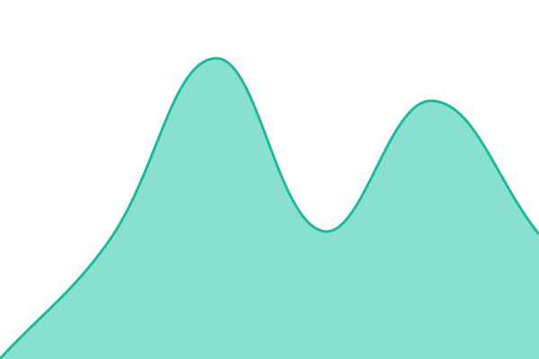

# [📈 Live Status](https://status.diwa.ai): <!--live status--> **All Systems Operational**

This repository is the uptime monitor and status page for [Diwa AI](https://www.diwa.ai), powered by [Upptime](https://upptime.js.org).

[Visit the status website →](https://status.diwa.ai)

<!--start: status pages-->
<!-- This summary is generated by Upptime (https://github.com/upptime/upptime) -->
<!-- Do not edit this manually, your changes will be overwritten -->
<!-- prettier-ignore -->
| URL | Status | History | Response Time | Uptime |
| --- | ------ | ------- | ------------- | ------ |
|  [Diwa AI](https://www.diwa.ai) | Operational | [diwa-ai.yml](https://github.com/Diwa-AI/upptime/commits/HEAD/history/diwa-ai.yml) | 

 956ms
     
 | 

<a href="https://status.diwa.ai/history/diwa-ai">100.00%</a>
    

|  [Diwa API](https://www.diwa.ai/api/v1/health) | Operational | [diwa-api.yml](https://github.com/Diwa-AI/upptime/commits/HEAD/history/diwa-api.yml) | 

 830ms
     
 | 

<a href="https://status.diwa.ai/history/diwa-api">100.00%</a>
    

<!--end: status pages-->

## 📄 License

- Powered by: [Upptime](https://github.com/upptime/upptime)
- Code: [MIT](./LICENSE) © [Diwa AI](https://www.diwa.ai)
- Data in the `./history` directory: [Open Database License](https://opendatacommons.org/licenses/odbl/1-0/)
